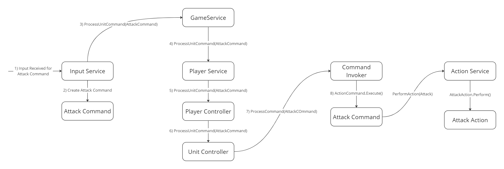

# Command Tactics

A turn-based battle game inspired by retro Final Fantasy games, implementing the **Command Pattern** to manage game actions and mechanics such as Undo and Replay. This project emphasizes the use of the **Command Pattern** to encapsulate actions, providing flexibility and scalability.

---

## **Command Pattern Overview**

### **Command Pattern Components**

- **Abstract Command**: Template for any command with an `Execute()` method.
- **Concrete Command**: Implements specific actions such as `Attack` and `Heal`.
- **Client**: Responsible for creating and setting up commands (e.g., player actions).
- **Command Invoker**: Triggers the execution of commands and stores them for Replay or Undo.
- **Receiver**: Performs the actual logic associated with a command (e.g., `UnitController` executes the `Attack`).

---

## **Features**

- **Turn-Based Combat**: Players take turns executing actions like attacking, healing, and buffing.
- **Replay and Undo Mechanics**: Rewatch battles and undo actions using stored commands.
- **Diverse Actions**: Multiple actions to strategize and counter enemy tactics.
- **Unit Customization**: Configure units with unique abilities and stats using Scriptable Objects.
- **Extensible Design**: Add new actions and units easily by extending the Command Pattern.

---

## **Learning Outcomes**

- **Command Pattern**: Learned to encapsulate requests as objects, enabling flexible gameplay mechanics.
- **Replay/Undo Systems**: Implemented robust replay and undo functionality.
- **Modular Architecture**: Designed a scalable structure using MVC and Service Locator.
- **Scriptable Objects**: Leveraged Unity's Scriptable Objects for flexible data-driven configurations.
- **Turn-Based Game Design**: Gained insights into creating strategic turn-based combat systems.

---

## **Project Structure**

### **Core Components**

1. **Game Service**
   - Acts as the Service Locator and manages overall game state.
2. **SoundService**
   - Manages sound effects and background music.
3. **EventService**
   - Handles event-based communication.
4. **ActionService**
   - Executes commands for actions like Attack and Heal.
5. **InputService**
   - Processes player inputs.
6. **CommandInvoker**
   - Manages and executes command objects.
7. **BattleService**
   - Configures and handles battles based on Scriptable Objects.
8. **PlayerService** 
   - Maintains players and their units.
9. **UIService**
   - Maintains all the UI Elements.
10. **ReplayService**
   - Enables replay of actions.

---

## **Gameplay Elements**

### **1. Player Actions**

- **Attack**: Inflicts damage on enemy units.
- **Heal**: Restores health to allied units.
- **AttackStance**: Buffs attack power temporarily.
- **Cleanse**: Removes debuffs from allied units.
- **Meditate**: Restores health and energy.
- **BerserkAttack**: High-damage attack with reduced defense.
- **ThirdEye**: Reveals enemy weaknesses or buffs allies.

### **2. Replay and Undo**

- **Replay**: Rewatch previous turns to analyze strategies.
- **Undo**: Revert the most recent action to adjust gameplay.

### **3. Unit Management**

- Units have health, attack power, and unique abilities.
- Customizable stats and abilities through Scriptable Objects.

---

## **How Command Pattern Works**

### **Step-by-Step Flow**

1. **Player Input or Replay**: The **Input Service** (for normal gameplay) or **Replay Service** (for replay) acts as the Client to fetch the input and create the corresponding Command (e.g., `AttackCommand`), inheriting from the Abstract Command.
2. **Game Service**: Receives the Command and forwards it to the `PlayerService`.
3. **Player Service**: Sets the actor and target units for the Command and forwards it to the `PlayerController`.
4. **Player Controller**: Directs the Command to the appropriate `UnitController`.
5. **Unit Controller**: Forwards the Command to the `CommandInvoker`.
6. **Command Invoker**: Passes the Command to the `ActionService` (Receiver) and stores it for Replay or Undo.
7. **Action Service (Receiver)**: Executes the logic for the action (e.g., applying damage or healing).

---

## **Visual Representations**

To illustrate the Command Pattern flow and Replay functionality, you can include the following placeholders for images:

### **Command Pattern Components**


- **Description**: Represents the interaction between the components of the Command Pattern.

### **Normal Command Flow**


- **Description**: Displays the interaction between the Client, Command Invoker, and Receiver during a normal command execution.

### **Replay Flow**


- **Description**: Showcases how stored commands are re-executed by the ReplayService for playback functionality.

---

## __Setting Up the Project__

1. **Clone the Repository**:
   ```bash
   git clone https://github.com/123rishiag/Command-Tactics.git
   ```
2. Open the project in Unity.

---

## __Video Demo__

[__Watch the Gameplay Video__](https://www.loom.com/share/4ae2f3a5bc8344d884080864a6cb4460?sid=1d1f7868-aa67-449a-8e44-081c2b74169a)

## __Play Link__

[__Play the Game__]()

